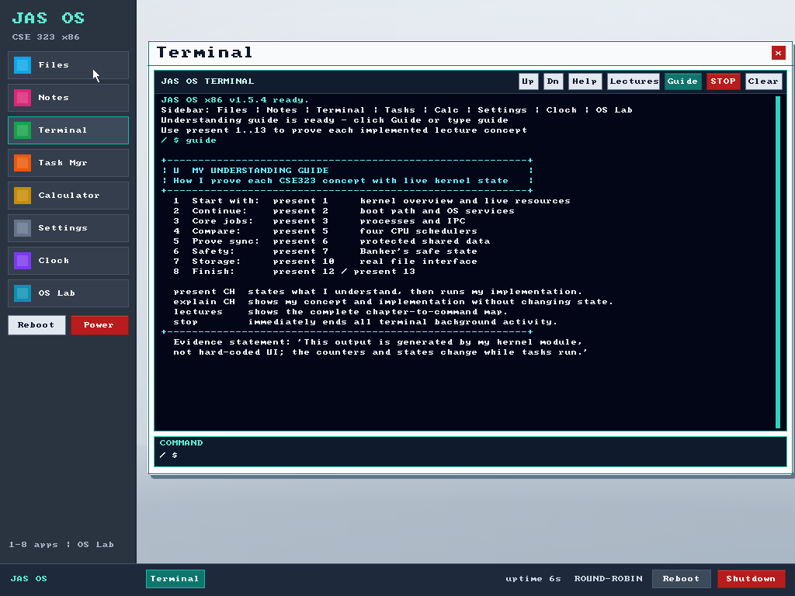

# JAS OS


JAS OS is a bootable, freestanding 32-bit x86 course-project operating system
created by **Jubayed Ahmed Sahel** for CSE 323. Its motive is to implement, test,
and prove my own understanding of the main lecture concepts from chapters 1-13
through observable kernel behavior in Oracle VirtualBox. It is not intended as
a system for teaching other people. Chapter 14 onward is outside the scope.



## Submission package

| Deliverable | Link |
|---|---|
| Bootable operating system | [Download `jas-os.iso`](jas-os.iso) |
| Demonstration videos | [4:20 narrated overview](docs/JAS-OS-demo.mp4) · [4:00 silent terminal-and-cursor demo](docs/JAS-OS-Silent-Terminal-Demo.mp4) · [voice-over script](docs/SILENT_DEMO_VOICEOVER_SCRIPT.md) |
| Editable demonstration | [PowerPoint with narration](docs/JAS-OS-Demonstration.pptx) · [raw VirtualBox WebM](docs/JAS-OS-Silent-Terminal-Demo.webm) |
| Technical report | [PDF](docs/JAS-OS-Technical-Report.pdf) · [Editable DOCX](docs/JAS-OS-Technical-Report.docx) · [GitHub-readable STAR report](docs/TECHNICAL_REPORT.md) |
| Presentation support | [Timed narration and command script](docs/DEMO_SCRIPT.md) |
| Architecture | [System architecture notes](docs/ARCHITECTURE.md) |
| Submission checklist | [Final checklist](SUBMISSION.md) |

Repository: <https://github.com/Jubayed-Sahel/JAS-OS>

## What is implemented

| Chapter | Main concept | Live proof |
|---:|---|---|
| 1 | OS organization and resources | `present 1` |
| 2 | Services, syscalls, and boot | `present 2` |
| 3 | Processes and IPC | `present 3` |
| 4 | Threads and shared state | `present 4` |
| 5 | CPU scheduling | `present 5` |
| 6 | Synchronization | `present 6` |
| 7 | Deadlocks | `present 7` |
| 8 | Main-memory allocation | `present 8` |
| 9 | Virtual memory | `present 9` |
| 10 | File-system interface | `present 10` |
| 11 | File-system implementation | `present 11` |
| 12 | Mass storage | `present 12` |
| 13 | I/O systems | `present 13` |

The algorithms are backed by separate kernel modules rather than static GUI
labels. Live output includes task IDs and states, CPU slices, semaphore values,
heap statistics, safe sequences, page faults and frame ownership, file-system
metadata, disk-head movement, and I/O counters.

## Desktop applications

- **Files** - browse, create, open, and delete MiniFS entries.
- **Notes** - edit files stored in MiniFS.
- **Terminal** - high-contrast shell with understanding Guide, Lectures, scrolling, and STOP.
- **Task Manager** - inspect processes and terminate a selected task.
- **Calculator** - perform signed integer arithmetic.
- **Settings** - change wallpaper and CPU scheduling policy.
- **Clock** - view PIT-driven uptime and use a stopwatch.
- **OS Lab** - run my chapter 1-13 implementations and inspect their evidence.

## Understanding evidence mode

Open Terminal and click **Guide**, or type:

```text
guide
```

These commands help me demonstrate what I understand during assessment:

```text
explain 5    # state my understanding and implementation without changing state
present 5    # state my understanding, then run the live kernel proof
stop         # terminate all background activity but keep the shell responsive
lectures     # show the complete chapter-to-command map
```

`stop`, `stop all`, and `lab stop` are global emergency-stop aliases. Specific
lab controls such as `demo stop`, `thread stop`, and `rw stop` remain available.

## Boot and kernel architecture

```text
BIOS / El Torito ISO
        |
16-bit loader: sectors, VESA, A20, GDT
        |
32-bit protected mode and freestanding C kernel
        |
IDT + PIC + PIT + serial + PS/2 + framebuffer
        |
tasks | scheduler | sync | heap | paging | Banker | MiniFS | storage/I/O
        |
graphical desktop | applications | terminal | OS Lab
```

## Run in Oracle VirtualBox

1. Create a VM using **Other/Unknown (32-bit)**.
2. Allocate at least 64 MB RAM (512 MB is recommended).
3. Use **BIOS**, not EFI.
4. Set the pointing device to **PS/2 Mouse**.
5. Mount [`jas-os.iso`](jas-os.iso) as the optical disk.
6. Boot from DVD.

For QEMU:

```bash
qemu-system-i386 -cdrom jas-os.iso -m 128 -boot d
```

## Build from source

The build requires Python 3 and an `i686-elf` GCC/binutils toolchain. The build
script checks `tools/bin` first and then the system `PATH`.

```powershell
powershell -ExecutionPolicy Bypass -File .\build.ps1
```

or:

```bash
make
```

The build generates `build/jas-os.iso` and compatibility copies for older
VirtualBox attachments. The verified submission ISO is 1,523,712 bytes with:

```text
SHA-256  CC89E64B14337AFAE5DAEE51B2C7A059C92BE3D808551495B41C981EAF17A2C1
```

## Terminal command reference

```text
guide / understanding / explain 1..13 / present 1..13 / lectures
status / services / boot / syscall
tasks / create counter / ipc demo / thread demo|status|stop
schedule rr|priority|fcfs|sjf / priority ID 0..9 / burst ID TICKS / timeline
start / hold / continue / demo stop / rw demo|status|stop
banker status|safe|request|release
mem / mem test / fit demo
page demo|status|test / replace demo
ls / mkdir / cd / write / cat / rm / fsinfo / fsalloc demo
disk demo|fcfs|sstf|scan|cscan|clook / raid
io demo|status|poll|interrupt|dma|modes
calc A OP B / notes / note write|read|append|delete
stop / stop all / lab stop / clear / reboot / shutdown
```

## Course-project boundaries

JAS OS is a course-project kernel, not a production OS. Tasks are cooperative
step functions; applications execute in kernel space; MiniFS is RAM-backed for
the VM session; and paging, disk, RAID, and I/O are transparent models used to
test my understanding. The project does not claim user-mode isolation,
networking, a real disk driver, or production security.

## Author

**Jubayed Ahmed Sahel**<br>
Student ID: 2221173642<br>
CSE 323, Section 3
